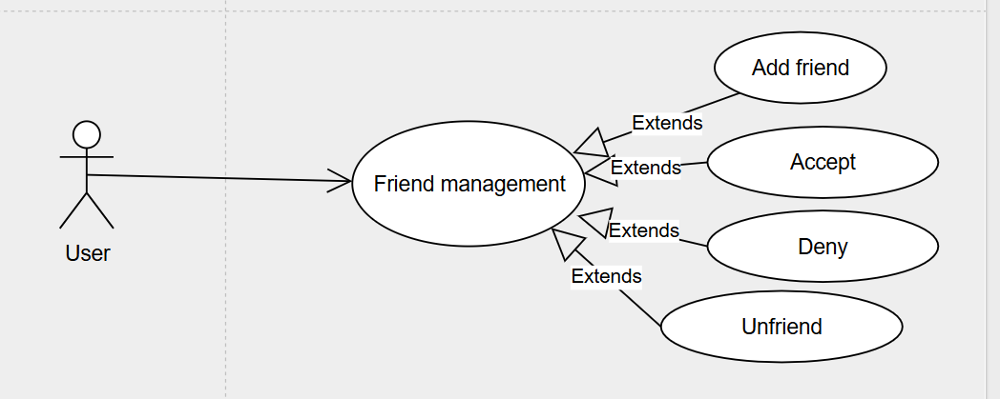

# add friend
```uml
@startuml
actor User
participant WebUI
participant FriendService
participant Database

== Send Friend Request ==
User -> WebUI : Select user to send friend request to
WebUI -> FriendService : Send userSenderId, userReceiverId
FriendService -> Database : Check if it exists in Friends table
alt Already exists
    FriendService --> WebUI : Return "Friend request already sent or already friends"
else Does not exist
    FriendService -> Database : Insert into Friends table\nstatus = pending
    Database --> FriendService : OK
    FriendService --> WebUI : Return success result
end
WebUI --> User : Display result
@enduml
```

# accept
```uml
@startuml
actor User
participant WebUI
participant FriendService
participant Database

== Chấp nhận lời mời kết bạn ==
User -> WebUI : Chọn người muốn chấp nhận
WebUI -> FriendService : Gửi userSenderId, userReceiverId
FriendService -> Database : Cập nhật Table Friends\nset status = accepted
Database --> FriendService : OK
FriendService --> WebUI : Trả kết quả
WebUI --> User : Hiển thị chấp nhận thành công
@enduml
```

# reject
```uml
@startuml
actor User
participant WebUI
participant FriendService
participant Database

== Từ chối lời mời kết bạn ==
User -> WebUI : Chọn người muốn từ chối
WebUI -> FriendService : Gửi userSenderId, userReceiverId
FriendService -> Database : Cập nhật Table Friends\nset status = rejected
Database --> FriendService : OK
FriendService --> WebUI : Trả kết quả
WebUI --> User : Hiển thị từ chối thành công
@enduml
```

# unfriend
```uml
@startuml
actor User
participant WebUI
participant FriendService
participant Database

== Huỷ kết bạn ==
User -> WebUI : Chọn người muốn huỷ kết bạn
WebUI -> FriendService : Gửi userSenderId, userReceiverId
FriendService -> Database : Xoá record trong Table Friends\ntheo 2 user ID
Database --> FriendService : OK
FriendService --> WebUI : Trả kết quả
WebUI --> User : Hiển thị huỷ kết bạn thành công
@enduml
```