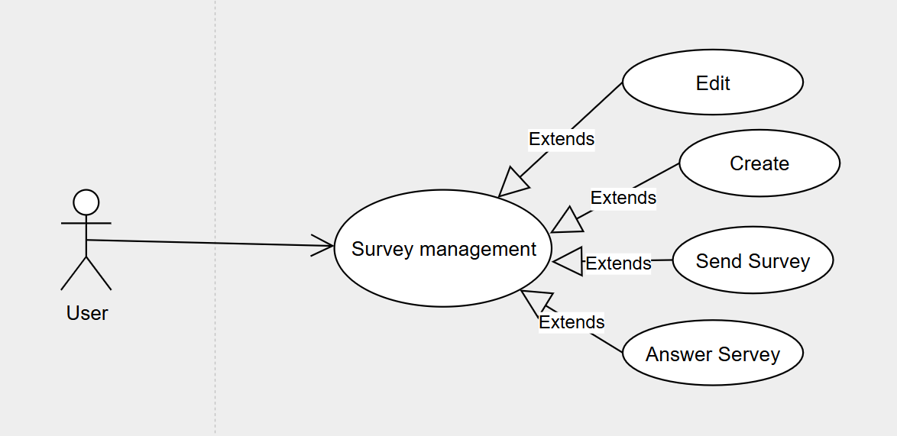

# create survey
```uml
@startuml
actor User
participant WebUI
participant SurveyService
participant Database

== Tạo Survey ==
User -> WebUI : Nhập thông tin form và các câu hỏi
WebUI -> SurveyService : Gửi dữ liệu survey

SurveyService -> SurveyService : Kiểm tra các requirement
alt Không đạt yêu cầu
    SurveyService --> WebUI : Trả thông báo lỗi
else Đạt yêu cầu
    SurveyService -> Database : Lưu survey vào Table Surveys (gồm userId,...)
    Database --> SurveyService : Trả về surveyId mới

    loop Với mỗi câu hỏi
        SurveyService -> Database : Lưu câu hỏi vào Table Questions (kèm surveyId)
    end

    SurveyService --> WebUI : Trả kết quả thành công
    WebUI --> User : Hiển thị thông báo tạo survey thành công
end
@enduml
```

# update survey
```uml
@startuml
actor User
participant WebUI
participant SurveyService
participant Database

== Cập nhật Survey ==
User -> WebUI : Chọn survey, chỉnh sửa câu hỏi
WebUI -> SurveyService : Gửi câu hỏi đã chỉnh sửa

SurveyService -> Database : Lấy survey mới nhất từ Table Surveys\nbằng userId
Database --> SurveyService : Trả về surveyId mới nhất

SurveyService -> SurveyService : Kiểm tra requirement
alt Không hợp lệ
    SurveyService --> WebUI : Trả về lỗi
else Hợp lệ
    SurveyService -> Database : Tạo bản ghi mới trong Table Surveys (survey mới)
    Database --> SurveyService : Trả về surveyId mới

    loop Với mỗi câu hỏi mới và cũ
        SurveyService -> Database : Lưu câu hỏi vào Table Questions (gắn surveyId mới)
    end

    SurveyService --> WebUI : Trả kết quả thành công
    WebUI --> User : Hiển thị "Đã cập nhật survey thành công"
end
@enduml
```

# send survey
```uml
@startuml
actor User
participant WebUI
participant SurveyService
participant Database

== Gửi Survey ==
User -> WebUI : Chọn người nhận và survey
WebUI -> SurveyService : Gửi userSenderId, userReceiverId, surveyId
SurveyService -> Database : Lưu vào Table Survey_User\n(userSenderId, userReceiverId, surveyId)
Database --> SurveyService : Trả về kết quả thành công
SurveyService --> WebUI : Trả về kết quả
WebUI --> User : Hiển thị gửi thành công
@enduml
```

# reply survey
```uml
@startuml
actor User
participant WebUI
participant SurveyService
participant Database

== Trả lời Survey ==
User -> WebUI : Chọn survey để trả lời
WebUI -> SurveyService : Gửi surveyId và câu trả lời
SurveyService -> Database : Cập nhật Table Survey_User\nvới isAnswered = true theo user và survey
SurveyService -> Database : Lấy danh sách câu hỏi từ Table Questions\ntheo surveyId
SurveyService -> SurveyService : Lưu câu trả lời vào bảng các Questions vừa được lấy ra
Database --> SurveyService : Trả về kết quả thành công
SurveyService --> WebUI : Trả về kết quả
WebUI --> User : Hiển thị trả lời thành công
@enduml
```