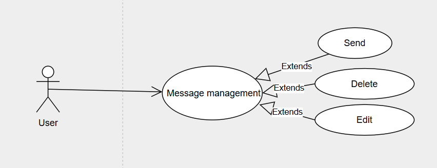

# send
```uml
@startuml
actor User
participant WebUI
participant MessageService
participant Database

== Send Message ==
User -> WebUI : Nhập nội dung message và nhấn "Send"
activate WebUI

WebUI -> MessageService : Gửi nội dung message
activate MessageService

alt Nội dung trống hoặc không hợp lệ
    MessageService --> WebUI : Trả lỗi "Nội dung không được để trống"
    deactivate MessageService
    WebUI --> User : Hiển thị thông báo lỗi
else Nội dung hợp lệ
    MessageService -> Database : Lưu vào Table Message\n(senderId, receiverId, content, ...)
    activate Database
    Database --> MessageService : Xác nhận lưu
    deactivate Database

    MessageService --> WebUI : Trả kết quả gửi thành công
    deactivate MessageService

    WebUI --> User : Hiển thị message mới
    deactivate WebUI
end
@enduml
```

# unsend
```uml
@startuml
actor User
participant WebUI
participant MessageService
participant Database

== Unsend Message ==
User -> WebUI : Chọn message và nhấn "Unsend"
activate WebUI

WebUI -> MessageService : Gửi messageId cần unsend
activate MessageService

MessageService -> Database : Đánh dấu isDeleted = true\ntrong Table Message với messageId
activate Database
Database --> MessageService : Xác nhận cập nhật
deactivate Database

MessageService --> WebUI : Trả kết quả unsend thành công
deactivate MessageService

WebUI --> User : Ẩn hoặc hiển thị thông báo "Message đã bị thu hồi"
deactivate WebUI
@enduml
```

# edit
```uml
@startuml
actor User
participant WebUI
participant MessageService
participant Database

== Edit Message ==
User -> WebUI : Chọn message và sửa nội dung
activate WebUI

WebUI -> MessageService : Gửi messageId + nội dung mới
activate MessageService

alt Nội dung trống hoặc không hợp lệ
    MessageService --> WebUI : Trả lỗi "Nội dung không được để trống"
    deactivate MessageService
    WebUI --> User : Hiển thị thông báo lỗi
else Nội dung hợp lệ
    MessageService -> Database : Cập nhật content trong Table Message\nvới messageId
    activate Database
    Database --> MessageService : Xác nhận cập nhật
    deactivate Database

    MessageService --> WebUI : Trả kết quả edit thành công
    deactivate MessageService

    WebUI --> User : Hiển thị nội dung message đã cập nhật
    deactivate WebUI
end
@enduml
```